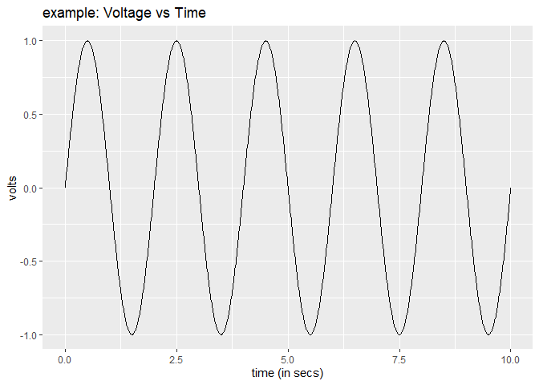
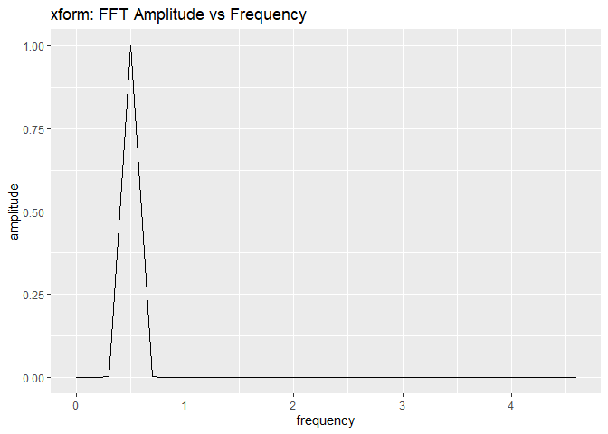
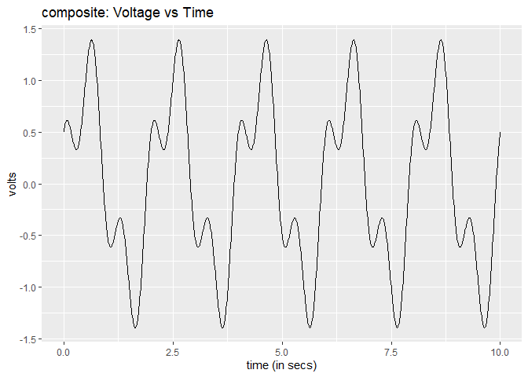
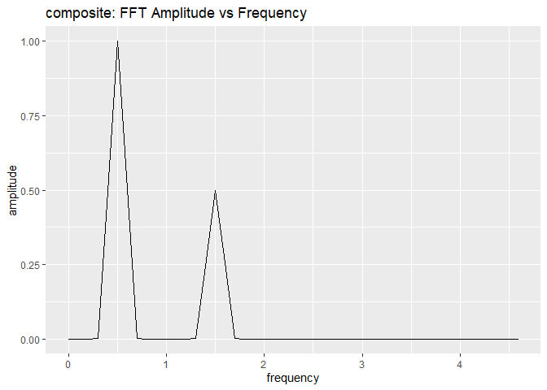
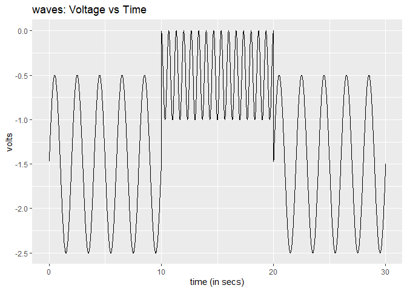
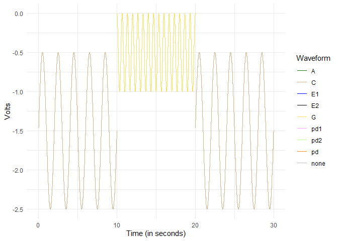
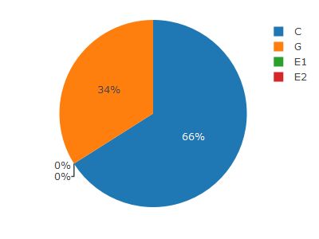
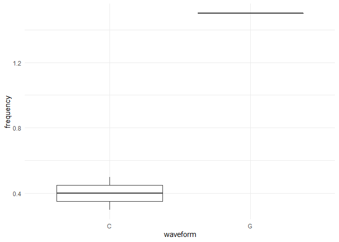

<!-- README.md is generated from README.Rmd. Please edit that file -->

# epgminer

<!-- badges: start -->

<!-- badges: end -->

Electrical Penetration Graph (EPG) is a technique used to monitor insect
feeding behavior. Studying the voltage waveforms in EPG data allows one
to analyze the insect-host relationship and gain insights into what
makes a suitable host.

To facilitate the analysis of EPG data, epgminer contains various
functions for working with voltage time series data as well as ANA
annotation files from manual annotation software.

One primary utility of using epgminer for analysis is the ability to
calculate frequencies using the Fourier Transform. In this way,
waveforms both within and between datasets can be analyzed for
differences in constituent frequency. Other metrics such as duration and
count can also be calculated.

The other major function of the package epgminer is the ability to
generate visuals. The plotting functions are all in the format plot\_x
where x denotes the type of plot. The types of plots currently supported
are: voltage time series, labeled time-series, Fourier transformed data,
frequency boxplot, and two types of pie charts.

## Installation

To install, use the following code:

``` r
# install.packages("devtools")
devtools::install_github("LylChun/epgminer")
```

## EPGminer Shiny App

All of the functionality of the epgminer package is also accessible
through the EPGminer app built using the Shiny framework. Additionally,
the app contains a novel algorithm for semi-automatic labeling of
waveforms without the need for manual annotations.

The app may be accessed in two ways: (i) directly through R using
epgminer::epgminer\_app(), or (ii) as a web application at:
<https://epgdata.shinyapps.io/epgminer_app/>

## Example

Data to be analyzed using epgpminer must be in one of the accepted file
formats. Raw voltage data must be in txt file(s) with the structure
time;volts. ANA annotation files must have the first two columns be
waveform then time. The columns do not need to be labeled, and any
columns after the first two will not be used. Additionally for ANA
files, the waveform codes will be converted as specified in the
label\_ana function when the raw data and annotation are combined.
Finally, data that is already labeled may be read in csv format with
columns labeled time, volts, and waveform.

Alternately, you may choose your own method of reading in and processing
the data, so long as the final dataframe has the correct columns: time,
volts. Or time, volts, waveform if using a waveform family function.

Note that although some frequency related functions allow the selection
of sample\_rate, others do not and will calculate using a default sample
rate of 100Hz which may result in errors if the true sample rate is not
equal to 100Hz.

### Frequency

To demonstrate the frequency calculation abilities of the package, we
will first generate a simple example waveform. Note that this is not
actual EPG data. It is merely a simple example of time-series data to
demonstrate the frequency calculation in epgminer.

``` r
library(epgminer)
library(tibble)
library(dplyr)
#> Warning: package 'dplyr' was built under R version 4.0.4
example <- tibble(time = seq(0, 10, 0.01), volts = sin(pi*time))
plot_vts(example, aggregate = FALSE)
```



This waveform can now be analyzed using the frequency family of
functions. For example, the Fourier transform can be applied using
single\_fft, then the transformed data plotted using plot\_fft to view
the frequency and amplitude. The separate transformation step may also
be skipped if pre\_fft is set to FALSE in plot\_fft (default).

``` r
xform <- single_fft(example)
plot_fft(xform, end = 5, pre_fft = TRUE)
```



To calculate the main frequency, we can use the function topfreq. In
this example, there is only one frequency, but on actual EPG data there
will be many constituent frequencies and only the single main one will
be chosen. We can visually double-check the output frequency and
amplitude by comparing to the voltage time series from the beginning.

``` r
round(topfreq(example), 2) 
#> # A tibble: 1 x 2
#>   mainfreq amplitude
#>      <dbl>     <dbl>
#> 1      0.5         1
```

To show the same analysis on a more complex waveform, we can create a
composite waveform and analyze it in the same manner. In this case, the
function mainfreqs was also used to display both constituent
frequencies. Note that topfreq simply returns the single main frequency
with the largest amplitude.

``` r
composite <- tibble(
  time = seq(0, 10, 0.01),
  volts = sin(pi*time) + 0.5*cos(3*pi*time)
)
plot_vts(composite, aggregate = FALSE)
```



``` r
plot_fft(composite, end = 5)
```



``` r
round(mainfreqs(composite, 2), 2)
#> # A tibble: 2 x 2
#>   mainfreq amplitude
#>      <dbl>     <dbl>
#> 1      0.5       1  
#> 2      1.5       0.5
round(topfreq(composite), 2)
#> # A tibble: 1 x 2
#>   mainfreq amplitude
#>      <dbl>     <dbl>
#> 1      0.5         1
```

### Waveform Specific Analysis

For waveform specific analysis, first we will create some example data.
In general, metrics should be run using waveform specific functions
unless the input data is already only a single waveform instance.

``` r
times <- tibble(
  time = seq(0.01, 30, 0.01),
  waveform = rep(1:3, rep(1000, 3))
)
waves <- times %>%
  group_by(waveform) %>%
  mutate(volts = dplyr::if_else(waveform %in% c(1, 3), 
                                sin(pi*time), 0.5*cos(3*pi*time)),
         waveform = dplyr::if_else(waveform %in% c(1, 3), "C", "G")) %>%
  select(time, volts, waveform) %>%
  ungroup()
plot_vts(waves, aggregate = FALSE)
```



Three metrics can be calculated for each waveform: frequency, duration,
and count. These metrics are applied per individual waveform or waveform
type in the case of count. Note that “C” and “G” were labeled simply as
examples and are not representative of true waveform C or G data.

``` r
wave_topfreq(waves)
#> # A tibble: 3 x 2
#>   waveform frequency
#>   <chr>        <dbl>
#> 1 C              0.5
#> 2 G              1.5
#> 3 C              0.5
wave_duration(waves)
#> # A tibble: 4 x 2
#>   waveform duration
#>   <chr>       <dbl>
#> 1 Feeding     30.0 
#> 2 C            9.99
#> 3 G            9.99
#> 4 C            9.99
wave_count(waves)
#> # A tibble: 2 x 2
#>   waveform count
#>   <chr>    <int>
#> 1 C            2
#> 2 G            1
```

Lastly, there are a number of visuals in the waveform family of
functions: plot\_wave, plot\_pie, and plot\_fbox. The plot\_wave shows
the data labeled by waveform using different colors for each waveform
type. The plot\_pie generates pie charts of time or count depending on
the input parameter pietype. These pie charts are generated using plotly
and are thus interactive within RStudio. The frequency variation boxplot
will show the variation in main frequency within a waveform type. The
example data has no variation but actual data can contain great
variation in frequency within a single waveform type.

``` r
# color coded by waveform
plot_wave(waves, aggregate = "none")
```



``` r
# pie chart of total time
plot_pie(waves, pietype = "time")
```



``` r
# pie chart of count
plot_pie(waves, pietype = "count")
```


``` r
# frequency variation 
plot_fbox(waves)
```


